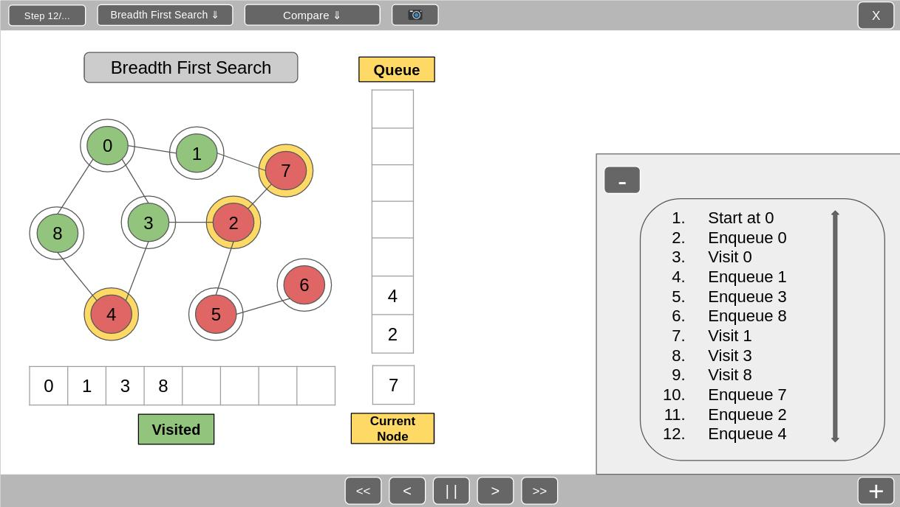

# School of Computing &mdash; Year 4 Project Proposal Form

## SECTION A

|                     |                       |
|---------------------|-----------------------|
|Project Title:       | AI Search Visualiser  |
|Student 1 Name:      | James Farrelly        |
|Student 1 ID:        | 17396736              |
|Student 2 Name:      | Emily Whyte           |
|Student 2 ID:        | 17405094              |
|Project Supervisor:  | Charlie Daly          |

## SECTION B

### Introduction

 AI Search Visualiser is a python program used for algorithm visualisation. The program will allow users to visualise various search algorithms; Depth-First Search, Breadth-First Search, Iterative Deepening Depth-First Search and A* Search. 

### Outline

 AI Search Visualiser begins with the main menu where the user selects the algorithm (listed above) they first wish to visualise. PyGame will be used to show users the search trees/graphs. There will be visited, queued, closed and current nodes, which will be shown in different colours. Users will be able to progress through the algorithm step by step, seeing each change take place. 

  Users will have the option to open a tab which will tell them what is happening at each step. There will also be an option to compare two algorithms at a time, so users can visually see the difference between how the algorithms work and which one might finish in less steps. Users will also have an option within the program to take a screenshot of the Visualiser window.

### Background

 The original idea to create an AI search space visualiser was suggested by our supervisor, Charlie Daly, primarily as a tool to help students studying the CA318: Advanced Algorithms and AI Search module. A large amount of algorithm visualisation tools available online make use of pathfinding with obstacles rather than simple trees/graphs, which are more common in the CA318 module. We were also inspired to pursue the development of this idea because of our experience in INTRA interviews as we were often asked to convey our understanding of different search algorithms.

### Achievements

* Choose from several algorithms to visualise.
* Visually show an algorithm as it works through a graph or tree.
* Where appropriate, users can select heuristics.
* Step through the algorithm at your own pace or let it play automatically.
* Optional display of the steps taken via text log.
* Colour coding of nodes is used to display open and closed lists.
* Compare different algorithms at the same time.
* Screenshot function allows users to capture any steps in the search process and save it to their computer.
* The majority of users will be students who are learning about AI search algorithms and find it easier to understand by visualising the process. The program will also prove useful to developers hoping to brush up on their knowledge of algorithms.

### Justification

 The AI Search Visualiser will be useful to students and developers that want to visualise search algorithms to gain a better understanding of them. The program will be useful to someone learning algorithms for the first time and somebody who learned them a long time ago and needs a reminder. For example, CA318 students can use the program in the time leading up to exams to check they carry out the right steps in performing a search. The screenshot feature is particularly useful as they can paste a full example of a search into their notes.

### Programming language(s)

* Python

### Programming tools / Tech stack

* PyGame module
* PyUnit module

### Hardware

 N/A

### Learning Challenges

 __PyGame__ - We need to learn how to use PyGame with Python to create the front-end of the program; this includes taking user input and generating visual representations of the algorithms.

 __AI Search Algorithms__ - We need to have a particularly strong understanding of the search algorithms so we can effectively implement, display and compare them in a way that is useful to users.

### Breakdown of work

#### James

* Main menu for selection of algorithms and any customisation - heuristics, custom nodes etc.
* Optional steps text log
* Algorithm and display of Depth-First Search
* Algorithm and display of Iterative Deepening Depth-First Search

#### Emily

* Controls to be used in algorithm visualisation (stepping forward, play, screenshot etc.)
* Comparison tool
* Algorithm and display of Breadth-First Search
* Algorithm and display of A* Search

### James and Emily

* PyUnit tests for code written throughout development for debugging and testing purposes

## Mock-up UI

  

